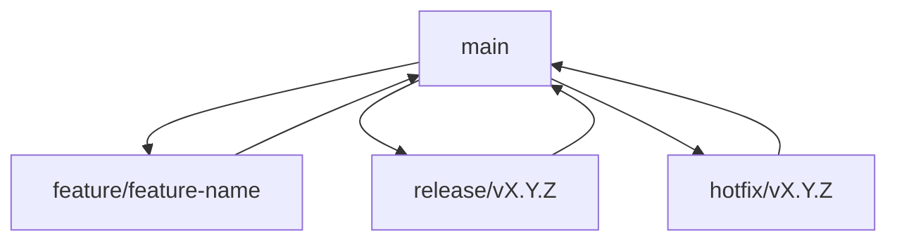

# AIM Project CI/CD Concise Guide

This guide provides a quick and practical CI/CD operation guide for solo developers of the AIM project.

## 🚀 Quick Start

### Environment Check
```bash
# Check basic environment
git config --list | grep -E "(user\.name|user\.email)"
go version
make help
```

### Common Commands Quick Reference

| Operation | Command |
|-----------|---------|
| Check current version | `make version` |
| Create RC version | `make rc` |
| Create official release | `make release` |
| Run tests | `make test` |
| Code checks | `make check` |
| Build for all platforms | `make build-all` |

## 📦 Version Release Process

### 1. Patch Release
Used for backward-compatible bug fixes.

```bash
# 1. Create hotfix branch
git checkout -b hotfix/v0.1.0

# 2. Fix issues and commit
git add .
git commit -m "fix: resolve crash when loading invalid config"

# 3. Run tests
make test

# 4. Merge to main
git checkout main
git merge --no-ff hotfix/v0.1.0

# 5. Create version tag
git tag -a v0.1.0 -m "Release v0.1.0

Bug fixes:
- Fix crash when loading invalid config
- Improve error handling for missing files"

# 6. Push tag to trigger automatic release
git push origin v0.1.0

# 7. Delete hotfix branch
git branch -d hotfix/v0.1.0
```

### 2. Minor Release
Used for adding backward-compatible new features.

```bash
# 1. Create release branch
git checkout -b release/v0.2.0

# 2. Update version information and documentation
# ... make necessary updates ...

# 3. Commit changes
git add .
git commit -m "feat: prepare for v0.2.0 release"

# 4. Create RC version (optional)
git tag -a v0.2.0-rc.1 -m "Release candidate v0.2.0-rc.1"
git push origin v0.2.0-rc.1

# 5. After testing RC version, create official release
git tag -a v0.2.0 -m "Release v0.2.0

New features:
- Add support for OpenAI API
- Add configuration validation
- Add interactive setup wizard"

# 6. Merge to main
git checkout main
git merge --no-ff release/v0.2.0

# 7. Push tag to trigger automatic release
git push origin v0.2.0

# 8. Delete release branch
git branch -d release/v0.2.0
```

### 3. Major Release
Used for significant version updates that include incompatible changes.

```bash
# 1. Create release branch
git checkout -b release/v1.0.0

# 2. Make major changes and update documentation
# ... make code changes and documentation updates ...

# 3. Commit changes
git add .
git commit -m "feat!: prepare for v1.0.0 major release

BREAKING CHANGE: Update CLI command structure"

# 4. Create RC version
git tag -a v1.0.0-rc.1 -m "Release candidate v1.0.0-rc.1"
git push origin v1.0.0-rc.1

# 5. Create official release after testing
git tag -a v1.0.0 -m "Release v1.0.0

Major changes:
- Redesigned CLI command structure
- Updated configuration file format
- Added migration guide for v0.x users

Breaking Changes:
- CLI commands restructured
- Configuration format updated
- Deprecated features removed"

# 6. Merge to main
git checkout main
git merge --no-ff release/v1.0.0

# 7. Push tag to trigger automatic release
git push origin v1.0.0

# 8. Delete release branch
git branch -d release/v1.0.0
```

## 🔧 Build Trigger Conditions

### Automatic Trigger Scenarios

| Trigger Condition | Workflow | Execution Time | Main Operations |
|-------------------|----------|----------------|-----------------|
| Push to main branch | CI | ~15 minutes | Tests, checks, build |
| Push version tag (v*.*.*) | Release | ~30 minutes | Multi-platform build, create Release |
| Push RC tag (v*.*.*-rc.*) | Pre-release | ~30 minutes | Multi-platform build, create pre-release |
| Create/update PR | PR Check | ~15 minutes | Tests, checks, change analysis |

### Avoiding Unnecessary Builds

```bash
# 1. Use Draft PR
gh pr create --draft --title "WIP: Feature" --body "Work in progress"

# 2. Skip CI
git commit -m "docs: update README [ci skip]"

# 3. Batch commits
git rebase -i HEAD~3
```

## 📋 Pre-release Checklist

### Code Quality
- [ ] All code checks pass (`make check`)
- [ ] All unit tests pass (`make test`)
- [ ] Test coverage meets requirements (>80%)
- [ ] No security vulnerabilities
- [ ] Code formatting follows standards

### Functionality Verification
- [ ] New features work as expected
- [ ] Existing features are not affected
- [ ] Edge case tests pass
- [ ] Error handling is correct
- [ ] Performance meets expectations

### Documentation Updates
- [ ] README.md updated
- [ ] CHANGELOG.md updated
- [ ] API documentation updated (if needed)
- [ ] User guide updated (if needed)
- [ ] Migration guide (if needed)

## 🛠️ Common Commands Reference

### Make Commands
```bash
# Build related
make build          # Build for current platform
make build-all      # Build for all platforms
make clean          # Clean build artifacts

# Test related
make test           # Run tests
make coverage       # Generate coverage report
make check          # Run all checks

# Code quality
make fmt            # Format code
make vet            # Static analysis
make lint           # Code review

# Dependency management
make mod            # Update dependencies

# Development environment
make dev-setup      # Set up development environment
make dev-install    # Install to development environment
make dev-test       # Test development environment
```

## 🔍 Troubleshooting

### Release Failures

**Problem**: GitHub Actions workflow fails

**Solution**:
```bash
# 1. Fix code issues
# ... fix code ...

# 2. Rerun tests
make test

# 3. Delete failed Release (if created)
# Manually delete on GitHub page

# 4. Delete incorrect tag
git tag -d v0.1.0
git push origin :refs/tags/v0.1.0

# 5. Recreate tag
git tag -a v0.1.0 -m "Release v0.1.0 (fixed)"
git push origin v0.1.0
```

### Version Number Conflicts

**Problem**: Version number already exists

**Solution**:
```bash
# 1. List all tags
git tag -l

# 2. Delete incorrect local tag
git tag -d v0.1.0

# 3. Delete incorrect remote tag
git push origin :refs/tags/v0.1.0

# 4. Create correct tag
git tag -a v0.1.2 -m "Release v0.1.2"
git push origin v0.1.2
```

### Incomplete Build Artifacts

**Problem**: Binary files for some platforms are missing

**Solution**:
```bash
# 1. Test build locally
make build-all VERSION=v0.1.0

# 2. Check build artifacts
ls -la bin/

# 3. Verify binary files
./bin/aim-linux-amd64 version
```

## 📊 Version Management Strategy

### Version Number Format
- **Official Release**: `MAJOR.MINOR.PATCH` (e.g., `v0.1.0`, `v1.2.3`)
- **Pre-release**: `MAJOR.MINOR.PATCH-rc.N` (e.g., `v0.1.0-rc.1`)

### Version Number Increment Rules
- **MAJOR**: Incompatible API changes
- **MINOR**: Backward-compatible feature additions
- **PATCH**: Backward-compatible bug fixes

### Branch Strategy


## 💡 Best Practices

### Version Management
- Keep version numbers incrementing, never decrement
- Use semantic versioning, strictly follow SemVer specification
- Create tags immediately after release completion
- Write clear release notes detailing changes in each version
- Avoid breaking changes whenever possible

### Branch Management
- Keep main branch stable, only merge tested code
- Feature branches should be short-lived and merged promptly
- Regularly clean up merged branches
- Use descriptive branch names that clearly express their purpose

### Release Process
- Ensure all tests pass
- Test binary files on different platforms
- Ensure documentation is updated synchronously with code
- Notify users of new releases promptly

## 📚 Related Documentation

- [CI/CD Design Plan](AIM_CI_CD_DESIGN.md) - Detailed CI/CD design plan
- [Version Management Strategy](VERSION_MANAGEMENT_STRATEGY.md) - Complete version management strategy
- [Release Process](RELEASE_PROCESS.md) - Detailed release process documentation
- [Build Trigger Conditions](BUILD_TRIGGERS.md) - Detailed explanation of build trigger conditions
- [Quick Release Guide](QUICK_RELEASE_GUIDE.md) - Quick reference guide

---

By following this guide, the AIM project's version releases will be more standardized, reliable, and efficient, while maintaining the flexibility and simplicity of solo development.