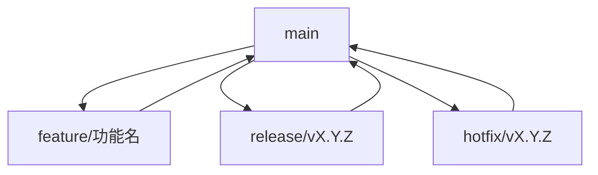

# AIM 项目 CI/CD 精简指南

本指南为 AIM 项目的单人开发者提供快速、实用的 CI/CD 操作指南。

## 🚀 快速开始

### 环境检查
```bash
# 检查基础环境
git config --list | grep -E "(user\.name|user\.email)"
go version
make help
```

### 常用命令速查

| 操作 | 命令 |
|------|------|
| 检查当前版本 | `make version` |
| 创建 RC 版本 | `make rc` |
| 创建正式版本 | `make release` |
| 运行测试 | `make test` |
| 代码检查 | `make check` |
| 构建所有平台 | `make build-all` |

## 📦 版本发布流程

### 1. 修复发布 (Patch Release)
用于向后兼容的问题修正。

```bash
# 1. 创建 hotfix 分支
git checkout -b hotfix/v0.1.0

# 2. 修复问题并提交
git add .
git commit -m "fix: resolve crash when loading invalid config"

# 3. 运行测试
make test

# 4. 合并到 main
git checkout main
git merge --no-ff hotfix/v0.1.0

# 5. 创建版本标签
git tag -a v0.1.0 -m "Release v0.1.0

Bug fixes:
- Fix crash when loading invalid config
- Improve error handling for missing files"

# 6. 推送标签触发自动发布
git push origin v0.1.0

# 7. 删除 hotfix 分支
git branch -d hotfix/v0.1.0
```

### 2. 功能发布 (Minor Release)
用于添加向后兼容的新功能。

```bash
# 1. 创建 release 分支
git checkout -b release/v0.2.0

# 2. 更新版本信息和文档
# ... 进行必要的更新 ...

# 3. 提交更改
git add .
git commit -m "feat: prepare for v0.2.0 release"

# 4. 创建 RC 版本（可选）
git tag -a v0.2.0-rc.1 -m "Release candidate v0.2.0-rc.1"
git push origin v0.2.0-rc.1

# 5. 测试 RC 版本后，创建正式版本
git tag -a v0.2.0 -m "Release v0.2.0

New features:
- Add support for OpenAI API
- Add configuration validation
- Add interactive setup wizard"

# 6. 合并到 main
git checkout main
git merge --no-ff release/v0.2.0

# 7. 推送标签触发自动发布
git push origin v0.2.0

# 8. 删除 release 分支
git branch -d release/v0.2.0
```

### 3. 主要发布 (Major Release)
用于包含不兼容变更的重要版本更新。

```bash
# 1. 创建 release 分支
git checkout -b release/v1.0.0

# 2. 进行重大变更和文档更新
# ... 进行代码修改和文档更新 ...

# 3. 提交更改
git add .
git commit -m "feat!: prepare for v1.0.0 major release

BREAKING CHANGE: Update CLI command structure"

# 4. 创建 RC 版本
git tag -a v1.0.0-rc.1 -m "Release candidate v1.0.0-rc.1"
git push origin v1.0.0-rc.1

# 5. 测试后创建正式版本
git tag -a v1.0.0 -m "Release v1.0.0

Major changes:
- Redesigned CLI command structure
- Updated configuration file format
- Added migration guide for v0.x users

Breaking Changes:
- CLI commands restructured
- Configuration format updated
- Deprecated features removed"

# 6. 合并到 main
git checkout main
git merge --no-ff release/v1.0.0

# 7. 推送标签触发自动发布
git push origin v1.0.0

# 8. 删除 release 分支
git branch -d release/v1.0.0
```

## 🔧 构建触发条件

### 自动触发场景

| 触发条件 | 工作流 | 执行时间 | 主要操作 |
|---------|--------|----------|----------|
| 推送到 main 分支 | CI | ~15 分钟 | 测试、检查、构建 |
| 推送版本标签 (v*.*.*) | Release | ~30 分钟 | 多平台构建、创建 Release |
| 推送 RC 标签 (v*.*.*-rc.*) | Pre-release | ~30 分钟 | 多平台构建、创建预发布 |
| 创建/更新 PR | PR Check | ~15 分钟 | 测试、检查、变更分析 |

### 避免不必要构建

```bash
# 1. 使用 Draft PR
gh pr create --draft --title "WIP: Feature" --body "Work in progress"

# 2. 跳过 CI
git commit -m "docs: update README [ci skip]"

# 3. 批量提交
git rebase -i HEAD~3
```

## 📋 发布前检查清单

### 代码质量
- [ ] 所有代码检查通过 (`make check`)
- [ ] 所有单元测试通过 (`make test`)
- [ ] 测试覆盖率符合要求 (>80%)
- [ ] 无安全漏洞
- [ ] 代码格式符合规范

### 功能验证
- [ ] 新功能按预期工作
- [ ] 现有功能未受影响
- [ ] 边界情况测试通过
- [ ] 错误处理正确
- [ ] 性能符合预期

### 文档更新
- [ ] README.md 更新
- [ ] CHANGELOG.md 更新
- [ ] API 文档更新（如需要）
- [ ] 用户指南更新（如需要）
- [ ] 迁移指南（如需要）

## 🛠️ 常用命令参考

### Make 命令
```bash
# 构建相关
make build          # 构建当前平台
make build-all      # 构建所有平台
make clean          # 清理构建产物

# 测试相关
make test           # 运行测试
make coverage       # 生成覆盖率报告
make check          # 运行所有检查

# 代码质量
make fmt            # 格式化代码
make vet            # 静态分析
make lint           # 代码审查

# 依赖管理
make mod            # 更新依赖

# 开发环境
make dev-setup      # 设置开发环境
make dev-install    # 安装到开发环境
make dev-test       # 测试开发环境
```

## 🔍 故障排除

### 发布失败

**问题**: GitHub Actions 工作流失败

**解决方案**:
```bash
# 1. 修复代码问题
# ... 修复代码 ...

# 2. 重新运行测试
make test

# 3. 删除失败的 Release（如果已创建）
# 在 GitHub 页面上手动删除

# 4. 删除错误的标签
git tag -d v0.1.0
git push origin :refs/tags/v0.1.0

# 5. 重新创建标签
git tag -a v0.1.0 -m "Release v0.1.0 (fixed)"
git push origin v0.1.0
```

### 版本号冲突

**问题**: 版本号已存在

**解决方案**:
```bash
# 1. 列出所有标签
git tag -l

# 2. 删除错误的本地标签
git tag -d v0.1.0

# 3. 删除错误的远程标签
git push origin :refs/tags/v0.1.0

# 4. 创建正确的标签
git tag -a v0.1.2 -m "Release v0.1.2"
git push origin v0.1.2
```

### 构建产物不完整

**问题**: 某些平台的二进制文件缺失

**解决方案**:
```bash
# 1. 本地测试构建
make build-all VERSION=v0.1.0

# 2. 检查构建产物
ls -la bin/

# 3. 验证二进制文件
./bin/aim-linux-amd64 version
```

## 📊 版本管理策略

### 版本号格式
- **正式版本**: `MAJOR.MINOR.PATCH` (例如: `v0.1.0`, `v1.2.3`)
- **预发布版本**: `MAJOR.MINOR.PATCH-rc.N` (例如: `v0.1.0-rc.1`)

### 版本号递增规则
- **MAJOR**: 不兼容的 API 变更
- **MINOR**: 向后兼容的功能新增
- **PATCH**: 向后兼容的问题修正

### 分支策略


## 💡 最佳实践

### 版本管理
- 保持版本号递增，永远不要递减版本号
- 使用语义化版本，严格遵循 SemVer 规范
- 完成发布后立即创建标签
- 编写清晰的发布说明，详细说明每个版本的变更
- 尽量避免破坏性变更

### 分支管理
- 保持 main 分支稳定，只合并经过测试的代码
- 功能分支应该短期存在并及时合并
- 定期清理已合并的分支
- 使用描述性分支名，清楚表达其用途

### 发布流程
- 确保所有测试通过
- 在不同平台上测试二进制文件
- 确保文档与代码同步更新
- 及时通知用户新版本发布

## 📚 相关文档

- [CI/CD 设计方案](AIM_CI_CD_DESIGN.md) - 详细的 CI/CD 设计方案
- [版本管理策略](VERSION_MANAGEMENT_STRATEGY.md) - 完整的版本管理策略
- [发布流程](RELEASE_PROCESS.md) - 详细的发布流程文档
- [构建触发条件](BUILD_TRIGGERS.md) - 构建触发条件详解
- [快速发布指南](QUICK_RELEASE_GUIDE.md) - 快速参考指南

---

通过遵循本指南，AIM 项目的版本发布将更加规范、可靠和高效，同时保持单人开发的灵活性和简洁性。